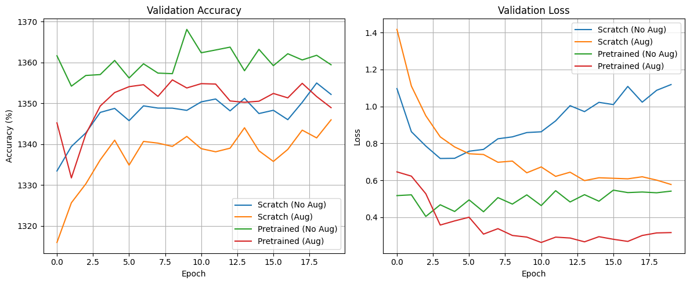

# **Task-1  Molte (Chatbot)**

## Check out the hosted bot --> https://molte-bot.streamlit.app/

**molte  - feminine plural form of the Italian word molto, which means "many" or "a great number"** 

### A multi-persona chatbot built using **LangChain** (providing the necessary framework for Chat history and persistence) and **Groq** (That provided the LLM model, and computing power to run in its servers). The specific LLM model used for this application is "llama-3.1-8b-instant", which is the lighter and faster version of its variants. Streamlit library is used to build a minimal frontend UI in a chatbot style for interacting with the bot. 

## Features:
- Conversation History tracking, to provide a streamline experience without having to rerun the program, and access the benefits of the model to track previous messages. 
- Multiple persons available such as shakespeare, pirate,yoda etc.
- Clear Chat functionality to reset the conversation history.

## How-to-use-this-bot: 

### 1. Clone the repository using the terminal, and install the dependencies from requirements.txt
```terminal
git clone https://github.com/SiddharthBayapaureddy/Image_Classifier.git
cd Image_Classifier
```

### Suggested to create a virtual environment
```terminal
python -m venv my_env
```

### Activate it
For Windows
```terminal
venv\Scripts\activate
```

For Linux/MacOS
```bash
source my_env/bin/activate
```

### Install the dependencies
```terminal
pip install -r requirements.txt
```

### 2. You would require a GROQ API key which you can get for free in the official website --> https://console.groq.com/keys. You can either hardcode the API key in this line: 
#### model = ChatGroq(model="llama-3.1-8b-instant" , api_key=YOUR_KEY)
### Or make a .env file to safetly access the API Key. 
### **DO NOT SHARE YOUR API KEY**


### 3.. To run the app, open the terminal and type
```terminal
streamlit run app.py
```

### 4. You can add your custom personas by adding new key (name of persona) and value (description on how the model should operate) inside the predefined_bot_personas dict.


## Project Structure

### molte/
### ├── app.py           --> Streamlit frontend
### ├── main.py          --> Backend: LangChain & Groq, actual model lies here. 
### ├── requirements.txt --> Python dependencies
### ├── .env             --> API key for Groq 
### └── README.md        --> This file


## Demo 


# **Task-2 Image Classifier**

### Objective:
### Building an image classifier for the CIFAR-10 dataset, using an CNN model: One that is built from scratch and other one that is pre-trained and fine-tuned ; both of which are trained on two datasets (Augmented and Non-Augmented) which brings us to a total of 4 cases. Comparing these results and identifying the best models of them all. Infering from the comparisions, accuracy, training and validation loss curves, confusion matrices etc., 

### **Scratch Model:**
####  Built it following the TinyVGG Architecture, that consists of two conv block, each one consisting 2 conv layers, 2 ReLU layers, and a MaxPool function to downsample. The FC layer flattens the channels into 10 output classes. 

### **Pre-Trained Model:**
#### For this, we've used the ResNet18 model of the ResNet family of pre-trained models since it's lightweight, so it is quicker and it is highly popular. 


### Results and Comparisions - 
#### Unsuprisingly, the results were expected and obvious - with the fine-tuned models beating the models built from scratch, and model in each case trained on augmented datasets performed better than its counterpart of model trained on non-augmented daatasets. 

#### Here are some training curves,confusion matrices, accuracies of said models -->

### 1. Scratch Model on Non-Augmented Data - 75% accuracy


### 2. Scratch Model on Augmented Data - 83% accuracy


### 3. Pretrained Model on Non-Augmented Data - 86.3% accuracy


### 4. Pretrained Model on Augmented Data - 91.20% accuracy


### Loss Curves



## Project Link: 
## https://colab.research.google.com/drive/1rVaipPesBvBpJXONz-8UzEoVAJ5i4DSB?usp=sharing
